# wx-mall

> 一个基于微信小程序的商城案例

## Build Setup

``` bash
# install dependencies
npm install

# serve with hot reload at localhost:8080
npm run dev

# build for production with minification
npm run build

# build for production and view the bundle analyzer report
npm run build --report
```

## Run project

1.项目服务端数据位于/database库中<br>
npm run db  启动json-server服务器(这里提供了一些测试用数据)<br>
可在微信web开发者工具中查看效果, 开发工具选择不校验安全域名

2.小程序分包<br>
对小程序进行分包，可以优化小程序首次启动的下载时间，以及在团队开发时更好协作<br>
*[参考文档](https://developers.weixin.qq.com/miniprogram/dev/framework/subpackages.html)

## Friendly Link

小程序开发文档
* [小程序api](https://developers.weixin.qq.com/miniprogram/dev/api/)

json-server服务器
* [json-server](https://github.com/typicode/json-server)

模拟数据
* [mockjs](https://github.com/nuysoft/Mock/wiki/Getting-Started)

腾讯位置服务

* [位置](https://lbs.qq.com/index.html)
* [微信小程序JavaScript SDK](https://lbs.qq.com/qqmap_wx_jssdk/index.html)

项目中的地点检索功能使用了[腾讯位置服务](https://lbs.qq.com/)中的微信小程序JavaScript SDK

使用步骤(具体使用详情见https://lbs.qq.com/qqmap_wx_jssdk/index.html)<br>
1.申请开发者密钥（key）：https://lbs.qq.com/console/key.html<br>
2.下载微信小程序JavaScriptSDK[下载地址](http://3gimg.qq.com/lightmap/xcx/jssdk/qqmap-wx-jssdk1.0.zip)<br>
3.安全域名设置


## Api

- baseUrl： `http://localhost:3000`

- 首页轮播图：`/bannar`

- 商品列表：`/products`

- 分类列表：`categories`

- 可选城市列表：`/citys`

- 购物车信息表：`/carts`
  - `/carts/id`
  - `/carts?userId=`

- 收货地址信息表：`/addresses`
  - `/addresses/id`
  - `/addresses?userId=`

- 商品收藏列表：`/favorites`
  - `/favorites/id`
  - `/favorites?userId=`

- 订单信息列表：`/orders`
  - `/orders/id`
  - `/orders?userId=`


## 项目效果图

<p align="center">
    <br>
    
    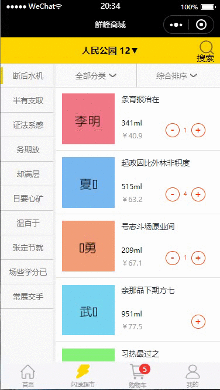
    <br>
    <br>
    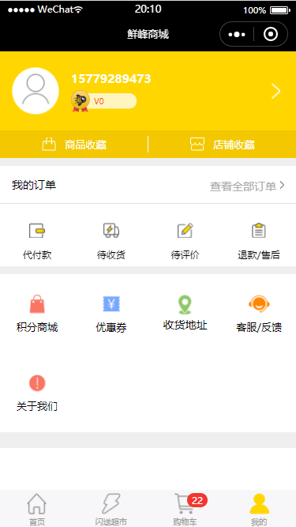
    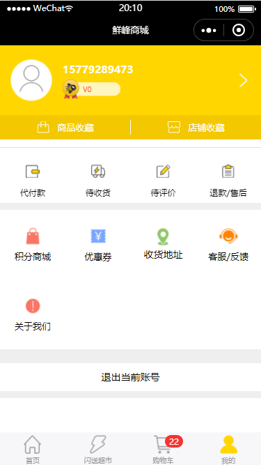
    <br>
  <br>
    
    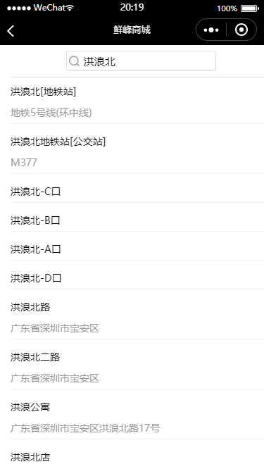
    <br>
  <br>
    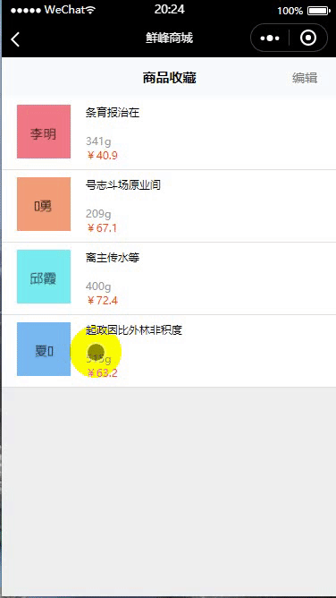
    
    <br>
  <br>
  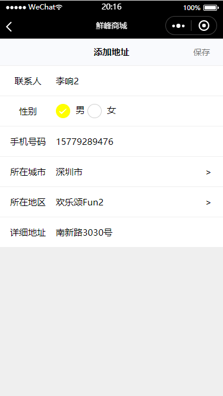
    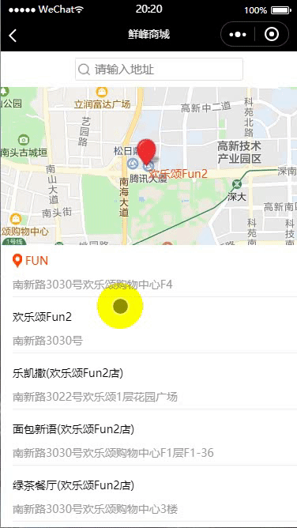
  <br>
  <br>
  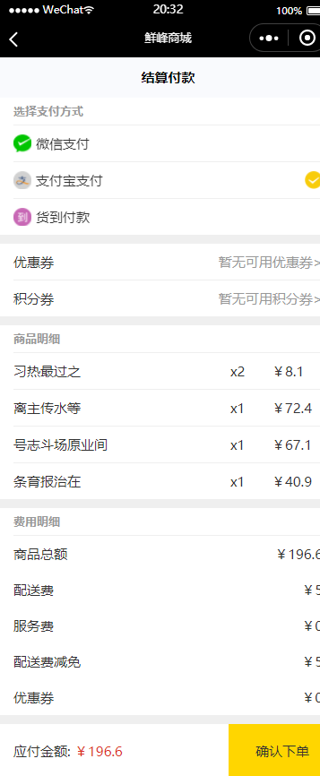
    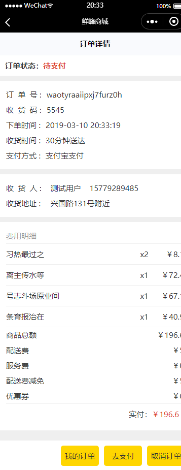
    <br>
  <br>
    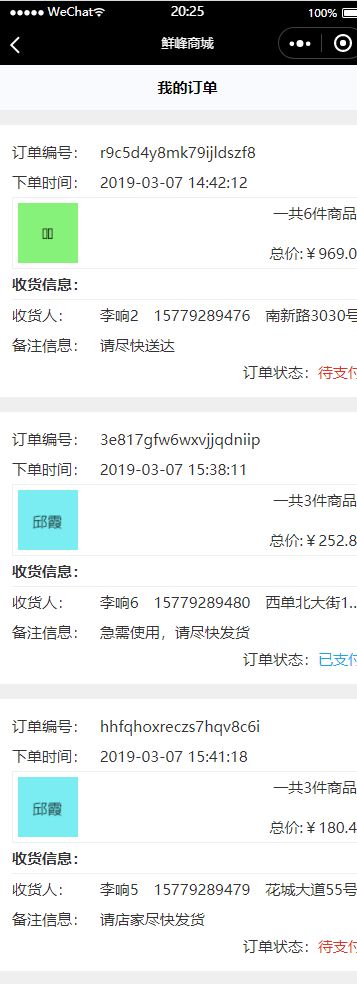
    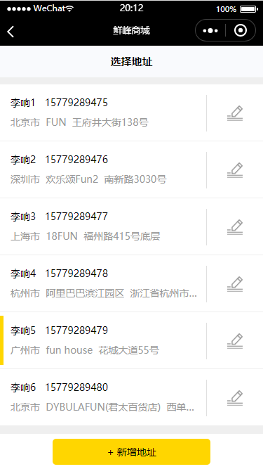
    <br>
</p>
